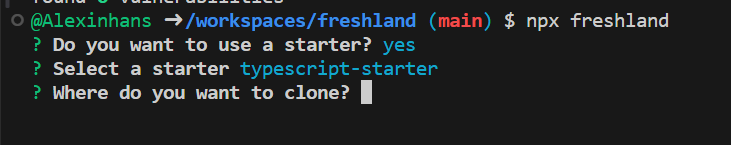

# Freshland

A tool that clones the repos easily

## Usage

### Clone a repo without using gui

```bash
npx freshland@latest clone proxitystudios/typescript-starter myapp
```

### Clone a repo with using gui

```bash
npx freshland@latest
```


